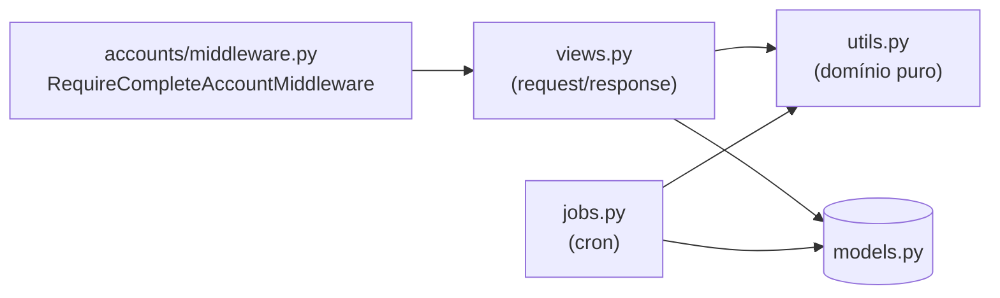
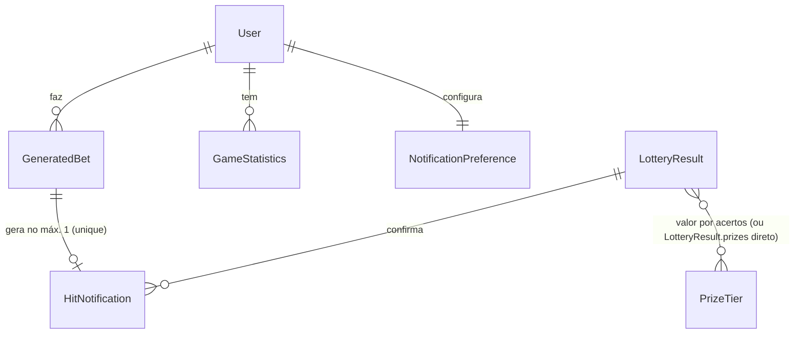
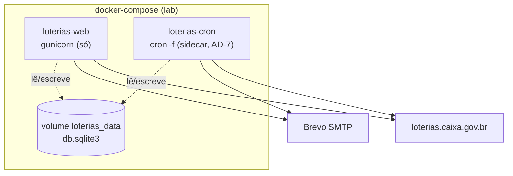

# Architecture Spine — Loterias: Verificação/Notificação de Resultados, Novo Cadastro e Renomeação de Código

## Design Paradigm

**Django MVT monolith**, com uma segunda forma de execução além do ciclo request/response: **jobs em lote (batch) agendados por cron**, que rodam num processo separado do processo web. As duas formas de execução (views HTTP e jobs de cron) **nunca se chamam nem compartilham estado em memória** — o único canal entre elas é o banco SQLite compartilhado (estilo de integração **Shared Database**, Hohpe/Woolf). Essa é a invariante que carrega o resto do spine: todo dado que um job de cron precisa expor para uma view (ou vice-versa) tem que passar por uma tabela, nunca por uma chamada de função entre os dois processos.

Camadas (mesmas de hoje, sem mudança de forma — só de nome):
- **Models** (`apps/*/models.py`) — estado persistido, única fonte de verdade.
- **Views** (`apps/*/views.py`) — ciclo request/response, autenticado via `@login_required` + middleware.
- **Jobs** (`apps/loterias_core/jobs.py`, novo) — funções batch chamadas só por management commands/cron, nunca por uma view.
- **Utils/serviços** (`apps/loterias_core/utils.py`) — lógica de domínio pura, chamada tanto por views quanto por jobs (ex.: `calculate_bet_prize`).

## Invariants & Rules



### AD-1 — Identificadores de código em inglês, inclusive legado [ADOPTED]

- **Binds:** todo o código Python do repositório (`apps/**`), novo e existente.
- **Prevents:** código novo em inglês misturado com código legado em português no mesmo módulo/PR, e dois builders escolhendo traduções diferentes para o mesmo símbolo legado.
- **Rule:** variáveis, constantes, classes, funções e model fields são em inglês. UI (labels, `verbose_name`, mensagens, e-mails) e o vocabulário de domínio em português (Jogo, Concurso, Acerto...) não mudam. O mapeamento completo nome-antigo → nome-novo é o da PRD §3.1 — este spine não o repete, só o referencia.

### AD-2 — Renomeação do legado é um epic isolado, antes das features novas, e é um PR/commit único [ADOPTED]

- **Binds:** rename-legado-§3.1, FR-1 a FR-14.
- **Prevents:** código FR-1..FR-14 nascendo parte em português (herdado) e parte em inglês (novo); um mapeamento §3.1 aplicado pela metade por vários sprints; e — achado na revisão adversarial deste spine — dois renomeadores trabalhando em paralelo (ex.: um em `GeneratedBet`, outro em `LotteryResult`/`GameStatistics`) escolhendo traduções diferentes para símbolos referenciados *entre* as três classes (`related_name='jogos'`/`'estatisticas'` em `models.py`, e `ResultadoLoteria.JOGOS_CHOICES = JogoGerado.JOGOS_CHOICES` — esses símbolos não estão na tabela de §3.1 e por isso são o ponto cego mais provável de import quebrado).
- **Rule:** o epic de renomeação é revisado e mergeado como **um único PR/commit**, nunca dividido por model entre builders independentes — justamente porque `related_name` e atributos de classe compartilhados (`JOGOS_CHOICES`) cruzam as três classes e não podem ser renomeados em paralelo com segurança. Antes de abrir esse PR, a PRD §3.1 precisa ganhar uma linha para `related_name` (`jogos`→`bets`, `estatisticas`→`statistics`) e para `JOGOS_CHOICES`→`GAME_CHOICES` — não estão lá hoje. O epic roda e passa 100% na suite de testes (`python manage.py test`) antes de qualquer story de FR-1 a FR-14 ser iniciada; a suite precisa cobrir os reverse accessors (`user.bets`, `user.statistics`) explicitamente, já que a suite atual não os exercita. Usa migrations `RenameModel`/`RenameField` (nunca dropar+recriar coluna/tabela) — seguro no SQLite bundled do Python 3.11 (≥ 3.25 já suporta `ALTER TABLE RENAME COLUMN`/`RENAME TO` nativamente, sem reconstrução de tabela). Antes de aplicar a migration de rename em produção, o runbook de deploy inclui copiar o arquivo do volume `loterias_data` (backup do `db.sqlite3`) — passo operacional, não código.

### AD-3 — Novos models de notificação ficam em `apps/loterias_core`

- **Binds:** `HitNotification`, `NotificationPreference`.
- **Prevents:** um app `notifications` novo surgindo ao lado de `loterias_core`, criando FK cruzando apps e um app extra para 2 models num projeto solo deste porte.
- **Rule:** `HitNotification` e `NotificationPreference` são declarados em `apps/loterias_core/models.py`, junto de `GeneratedBet`/`LotteryResult`/`GameStatistics`. `NotificationPreference.user` é `OneToOneField` (nunca mais de uma preferência por usuário). Ausência de linha para um usuário é lida, por qualquer leitor (inclusive `fetch_daily_results`), como os defaults de FR-6 (`site_enabled=True`, `email_enabled=False`) — um `get_or_create` só de leitura desses defaults não conta como "escrita do usuário" para efeito da regra de AD-4/Consistency Conventions sobre quem escreve `NotificationPreference`.

### AD-4 — GeneratedBet continua sendo o que as telas leem; HitNotification cobre por estado, não por evento

- **Binds:** FR-1, FR-3, FR-4, FR-5, FR-9, telas existentes (`bet_detail_view`, `history_view`).
- **Prevents:** (achado crítico na revisão adversarial, G1) — se a criação de `HitNotification` disparasse só "ao gravar um `LotteryResult` **novo**" dentro do próprio `fetch_daily_results`, qualquer escrita concorrente do mesmo `LotteryResult` pelo caminho sob demanda (`check_bet_result_view`/`save_manual_bet_view`, que já fazem `update_or_create` nesse mesmo Jogo+Concurso hoje) chegaria primeiro, o Jogo/Concurso deixaria de estar "em aberto" para a rotina diária, e **nenhum outro usuário** com `GeneratedBet` naquele mesmo Jogo+Concurso jamais receberia `HitNotification` — falha silenciosa de SM-1. O mesmo buraco reapareceria se `fetch_daily_results` morresse no meio do loop de notificações de um Jogo/Concurso já gravado: as reexecuções de AD-6 não o veriam mais como "aberto". Também previne duas fontes de verdade divergentes (`GeneratedBet` "sem prêmio" vs. `HitNotification` "premiado") e reescrita desnecessária de templates existentes.
- **Rule:** a cobertura de notificação é **derivada do estado, não do evento de escrita**. A cada execução, `fetch_daily_results` varre todo `GeneratedBet` cujo (game, contest) já tem `LotteryResult` — não só os que ele mesmo gravou nesta chamada — e que ainda não tem `HitNotification`; para cada um, cria a notificação (via `calculate_bet_prize`) e atualiza os campos-cache do `GeneratedBet` (`result_checked`, `hits`, `prize`, `prize_description`). Isso cobre tanto o `LotteryResult` escrito pelo caminho sob demanda quanto uma execução anterior que morreu no meio. `HitNotification.bet` é `OneToOneField` para `GeneratedBet` (unicidade garantida pelo banco, não só por convenção) e toda criação usa `get_or_create(bet=...)`; o e-mail de FR-7 só é disparado quando esse `get_or_create` retorna `created=True` — uma segunda tentativa concorrente (duas execuções de cron sobrepostas, AD-6) sempre encontra a linha já criada e nunca reenvia e-mail. Nenhum outro caminho de escrita cria `HitNotification` — só `fetch_daily_results`.

### AD-5 — Jobs de cron são funções + management command fino, nunca a função crua no CRONJOBS

- **Binds:** `fetch_daily_results`, `update_monthly_prize_values`.
- **Prevents:** lógica de job só testável/executável via cron, sem forma de rodar manualmente ou em teste automatizado. Também previne (achado da revisão adversarial, G5) duas implementações incompatíveis de "sei que sou a tentativa final do dia" — uma por introspecção de relógio dentro da função, outra por argumento externo — coexistindo sem nenhuma decidir o contrato.
- **Rule:** a lógica vive em `apps/loterias_core/jobs.py` como função pura — `fetch_daily_results(final: bool = False)` e `update_monthly_prize_values()`; cada uma ganha um management command homônimo em `apps/loterias_core/management/commands/` que só repassa os argumentos e chama a função. O command de `fetch_daily_results` aceita um flag `--final` (repassado como `final=True`). `CRONJOBS` (settings) aponta para `django.core.management.call_command` com o nome do command — nunca para a função Python direto.

### AD-6 — Retry de FR-9 é reexecução idempotente, não sleep bloqueante

- **Binds:** FR-9.
- **Prevents:** um job único dormindo até 30 min dentro do processo de cron, bloqueando outras entradas agendadas no mesmo container.
- **Rule:** `CRONJOBS` tem 3 entradas independentes rodando `fetch_daily_results` às 3h00, 3h15 e 3h30 (horário de Brasília — ver AD-7 para como o container garante esse fuso). A idempotência de FR-1 (não recria `LotteryResult` existente) garante que a 2ª/3ª chamada só reprocesse Jogo/Concurso ainda sem resultado. Só a entrada das 3h30 passa `--final` (AD-5); o e-mail de alerta ao operador (FR-9) só é disparado quando `fetch_daily_results(final=True)` roda, e só para Jogo/Concurso ainda sem `LotteryResult`.

### AD-7 — Jobs de cron rodam num container sidecar, não dentro do `loterias-web`

- **Binds:** deploy (`Dockerfile`, `deploy/lab/docker-compose.yml`), `loterias/settings/base.py`, FR-1, FR-8, FR-9.
- **Prevents:** assumir que "`django-crontab` no `requirements.txt` + `CRONJOBS` no settings" é suficiente. Três lacunas achadas na revisão (rubric + adversarial): (1) a imagem atual (`python:3.12-slim`) não instala pacote nenhum além do `pip install -r requirements.txt` — sem `cron` de fato instalado, `cron -f` não tem o que executar, mesmo com o serviço sidecar criado; (2) o container não define `TZ`, então o daemon de cron interpreta "3h00/3h15/3h30" em UTC (default do Docker), não em horário de Brasília — a rotina rodaria 3h mais cedo, antes dos sorteios noturnos terminarem, na hora exata que FR-1 diz evitar; (3) `loterias-cron` passa a ser um segundo processo escrevendo no mesmo `db.sqlite3` que `loterias-web` já escreve, e o Django settings de hoje não define `timeout`/modo WAL para SQLite — sob concorrência sustentada (o job percorre vários Jogos/Concursos por alguns minutos) isso pode gerar `database is locked` seguido por gambiarras diferentes por dev.
- **Rule:** o `Dockerfile` instala `cron` e `tzdata` via `apt-get` (além do `pip install` já existente) — usado pelas duas imagens (`loterias-web` não roda `cron`, mas construir a partir do mesmo Dockerfile é mais simples que manter dois). Um serviço novo `loterias-cron` no `docker-compose.yml`: mesma imagem/Dockerfile do `loterias-web`, `restart: unless-stopped` (mesma política do `loterias-web` — sem isso, o container pode morrer silenciosamente e FR-1/FR-8 param sem sinal nenhum), `TZ=America/Sao_Paulo` nas env vars, `CMD` diferente (`manage.py crontab add && cron -f`), montando o mesmo volume `loterias_data` e as mesmas env vars de e-mail/`SECRET_KEY`. `loterias-web` não muda — continua só `gunicorn`. `loterias/settings/base.py` ganha `DATABASES['default']['OPTIONS'] = {'timeout': 20}` a partir deste AD (não como um ajuste ad-hoc de quem primeiro bater em `database is locked` em produção). Os dois containers só se comunicam através do arquivo SQLite no volume compartilhado (ver Paradigma) — nunca por HTTP entre si nem por estado em memória.

### AD-8 — Um único middleware ordena os dois gates de conta incompleta (senha, depois nome/sobrenome), com allowlist explícita e exceção para staff

- **Binds:** FR-12, FR-14, AD-9.
- **Prevents:** (achados críticos G2/G3 da revisão adversarial) — um middleware construído ao pé da letra de "redireciona qualquer request autenticado com nome/sobrenome vazio" tranca, no deploy, **toda conta já existente** (todas têm `first_name`/`last_name` vazios hoje, inclusive a do próprio Ricardo/operador) para fora do `/admin/`, sem exceção nem migração de dados — a próxima página que o operador tentar abrir depois de logar no admin é redirecionada para a tela de captura, que não devolve o acesso ao admin. Separadamente, se esse gate não souber que a tela de criar-senha (AD-9/FR-12) precisa rodar **antes**, ele intercepta o próprio redirect pós-confirmação de e-mail e a senha nunca chega a ser definida.
- **Rule:** um único middleware, `RequireCompleteAccountMiddleware` (`apps/accounts/middleware.py`), aplica esta ordem de precedência a cada request autenticado, na sequência (para no primeiro que se aplicar):
  1. `request.user.is_staff` ou `is_superuser`, ou o path começa com `/admin/` → **sem gate**, segue normalmente (nunca tranca o operador fora do admin).
  2. `not request.user.profile_completed` (novo campo `BooleanField(default=True)` em `apps.accounts.models.User`) → **redireciona** para a tela de nome/sobrenome (FR-14), exceto se o path já for essa tela, um asset estático, ou logout.
  3. Caso contrário, segue.
  Uma migration de dados, criada junto com o campo, faz `profile_completed=True` para todo usuário que já existir na tabela antes desta feature (grandfather explícito — ninguém pré-existente é pego pelo gate). `CustomAccountAdapter.save_user()` (AD-9) cria toda conta nova do fluxo FR-10 com `profile_completed=False`; a tela de FR-14 marca `True` ao salvar nome/sobrenome. A allowlist do passo 2 é uma lista nomeada de URL names no próprio middleware (tela de captura, estáticos, logout, e qualquer endpoint auxiliar que a tela de captura use, ex.: toggle de tema) — nenhuma view individual faz essa checagem.
  Como AD-9 já torna "sem senha utilizável" auto-bloqueante para login (não chega a autenticar), este middleware só precisa arbitrar o gate de nome/sobrenome — o gate de senha nunca chega a ser um request autenticado até a view de FR-12 logar o usuário explicitamente.

### AD-9 — Cadastro email-primeiro inverte 3 defaults do allauth; conta pendente é representada por senha inutilizável, não por um campo novo

- **Binds:** FR-10, FR-11, FR-12, FR-13.
- **Prevents:** (achado HIGH da revisão rubric) tratar FR-10–FR-13 como "só estender `CustomSignupForm`/`CustomAccountAdapter`" e descobrir que os 3 settings do allauth hoje ativos fazem exatamente o oposto do fluxo pedido — `ACCOUNT_SIGNUP_FIELDS = ['email*', 'password1*', 'password2*']` (senha obrigatória já no cadastro, mas FR-10 quer só e-mail), `ACCOUNT_LOGIN_ON_EMAIL_CONFIRMATION = True` (login automático ao confirmar, mas FR-12 quer cair na tela de criar senha primeiro). Sem um AD, três builders resolvem "conta pendente" de três formas incompatíveis: um campo boolean novo em `User`, uma tabela de estado separada, ou um override solto de `adapter.login()` — cada um com implicações diferentes para o reuso do token de confirmação do allauth (FR-11/FR-13 dependem do mesmo mecanismo).
- **Rule:** `ACCOUNT_SIGNUP_FIELDS` passa a `['email*']` (sem senha no cadastro); `ACCOUNT_LOGIN_ON_EMAIL_CONFIRMATION` passa a `False`. `CustomAccountAdapter.save_user()` cria o usuário com `set_unusable_password()` — essa é a **única** representação de "conta pendente" (via `user.has_usable_password() == False`), sem campo novo no model. `CustomAccountAdapter` sobrescreve o redirect pós-confirmação (`get_email_confirmation_redirect_url`, ou equivalente) para apontar para uma view nova de "criar senha" (FR-12), em vez do redirect padrão do allauth. Essa view é o único lugar que chama `user.set_password()` seguido de login explícito (`django.contrib.auth.login`) — a partir daí a conta se comporta como qualquer outra. Login normal (formulário de e-mail/senha) já falha sozinho para uma conta com `set_unusable_password()` — não precisa de checagem extra para impedir login antes da senha (FR-10). `CustomSignupForm` perde os campos de senha e de nome/sobrenome (que migram para a tela de FR-14) — vira só e-mail.

### AD-10 — `PrizeTier` valida e precifica por faixa; `LotteryResult` não tem purge automático

- **Binds:** FR-8, FR-15, `update_monthly_prize_values`.
- **Prevents:** (resolve a lacuna de FR-8 registrada em Deferred na primeira versão desta espinha) dois builders modelando "tabela de valores de premiação vigentes" de formas incompatíveis — um como campo solto em `LotteryResult`, outro como settings/constants dict — e um terceiro decidindo sozinho se `LotteryResult` deveria ter purge automático (nenhum FR pedia isso; a resposta é não).
- **Rule:** `PrizeTier` é um model novo em `apps/loterias_core/models.py` (`game`, `hits`, `value`, `reference_month`; `unique_together = ('game', 'hits', 'reference_month')`). `update_monthly_prize_values()` (já prevista em AD-5) captura, todo mês, uma linha por (Jogo, quantidade de acertos premiada daquele Jogo) e, na mesma execução, apaga as linhas de `(game, hits)` além das 3 mais recentes por `reference_month` — nunca menos de 1, nunca mais de 3 retidas. `calculate_bet_prize` passa a validar "essa quantidade de acertos é premiada?" consultando `PrizeTier` (substitui a lista fixa de `if/elif` por Jogo hoje hardcoded), e usa `LotteryResult.prizes` quando disponível ou o `PrizeTier` vigente como fonte de valor — nunca estima fora desses dois. `LotteryResult` **não** ganha purge automático — retenção integral por padrão; o Django admin ganha uma ação customizada ("purge até uma data") que apaga `LotteryResult` anteriores a uma data informada pelo operador, sem afetar `PrizeTier` nem `GeneratedBet`.

## Consistency Conventions

| Concern | Convention |
| --- | --- |
| Naming (entities, files, interfaces, events) | Inglês em todo identificador de código (AD-1); português só em `verbose_name`, texto de UI/e-mail e vocabulário de domínio. Nomes de arquivo já são em inglês hoje (`models.py`, `views.py`, ...) — sem mudança aí. |
| Data & formats (ids, dates, error shapes, envelopes) | Valores monetários em `Decimal` (padrão já usado em `GeneratedBet.prize`). Datas em `DateTimeField(auto_now/auto_now_add)`, timezone do projeto. Flags booleanas de preferência/leitura sempre com `default` explícito (`is_read=False`, `NotificationPreference.site_enabled=True`, `NotificationPreference.email_enabled=False` — default de FR-6). |
| State & cross-cutting (mutation, errors, logging, config, auth) | `LotteryResult` só é escrito via `update_or_create(game=, contest=)` (idempotência de FR-1), pelos dois caminhos que hoje já existem (view sob demanda) mais o novo (`fetch_daily_results`) — nunca `create()` cru. `HitNotification` é criado só por `fetch_daily_results`, via `get_or_create(bet=...)` (AD-4) — o caminho sob demanda (`check_bet_result_view`) não cria notificação, só atualiza os campos-cache do bet que ele mesmo verificou. `NotificationPreference` só é escrito pela própria tela de preferências do usuário (leitura de default não conta, AD-3). Falha de e-mail (SMTP Brevo) nunca derruba a criação/exibição de `HitNotification` (FR-7) — send de e-mail é `try/except` isolado do resto do job. Cooldown/limite de reenvio (FR-11: 60s entre cliques, 5/dia) é calculado a partir do histórico de `EmailConfirmation` do próprio django-allauth (timestamp da última criada, contagem do dia) — sem novo model/campo só para isso. FR-2 (bloqueio de concurso já sorteado) é um comportamento **novo**, não o aviso que `create_bet_view`/`save_manual_bet_view` já fazem hoje para jogo duplicado do mesmo usuário: FR-2 bloqueia (não avisa) e checa a existência de `LotteryResult` para aquele (game, contest) — de qualquer usuário —, não jogos irmãos do mesmo usuário. Os dois checks continuam coexistindo, sem relação um com o outro. |

## Stack

| Name | Version |
| --- | --- |
| Python | 3.11 (pinned — Django 5.0.6 não suporta 3.13+) |
| Django | 5.0.6 |
| django-allauth | 0.63.3 |
| django-crontab | 0.7.1 (adicionar ao `requirements.txt` — não está lá hoje) |
| SQLite | bundled do Python 3.11 (≥ 3.25 já suportado — `ALTER TABLE RENAME COLUMN`/`RENAME TO` nativos, ver AD-2) |
| requests | 2.32.3 (já usado por `fetch_cef_result`) |
| gunicorn | 22.0.0 |
| ~~celery~~ / ~~redis~~ | remover do `requirements.txt` (Não-Objetivo explícito da PRD §5) |

`django-crontab` 0.7.1 é a única versão no PyPI e não recebe release desde março de 2016 — mais de uma década sem manutenção, não apenas "12+ meses". Não há issue reportada de quebra com Django 5 (é um pacote pequeno que só escreve linhas de crontab via `python-crontab`, não toca ORM/ASGI), mas a evidência é "nenhum sinal de problema", não "testado contra Django 5" — a própria documentação do pacote só reivindica compatibilidade até Django 1.8+. Risco tratado como baixo mas real, e registrado como tal (não subestimado): se quebrar numa versão futura de Django, o fallback é trivial — apontar o `cron` do sidecar direto para `python manage.py <command>` via `crontab -e`/arquivo `cron.d`, sem depender do pacote.

## Structural Seed

```text
apps/
  loterias_core/
    models.py                          # GeneratedBet, LotteryResult, GameStatistics (renomeados, AD-2)
                                        # + HitNotification (bet: OneToOneField, unique — AD-4)
                                        # + NotificationPreference (user: OneToOneField — AD-3)
                                        # + PrizeTier (game, hits, value, reference_month — AD-10)
    jobs.py                            # NOVO — fetch_daily_results(final=False), update_monthly_prize_values() (AD-5)
    management/commands/
      fetch_daily_results.py           # NOVO — aceita --final, repassa pra jobs.fetch_daily_results()
      update_monthly_prize_values.py   # NOVO — wrapper fino sobre jobs.update_monthly_prize_values()
    utils.py                           # funções renomeadas (AD-1/AD-2); calculate_bet_prize reaproveitada por AD-4
  accounts/
    models.py                          # + User.profile_completed (BooleanField, default=True — AD-8)
    migrations/                        # + data migration: profile_completed=True para usuários pré-existentes (AD-8)
    middleware.py                      # NOVO — RequireCompleteAccountMiddleware (AD-8)
    adapter.py                         # CustomAccountAdapter: set_unusable_password() + redirect pós-confirmação (AD-9)
    views.py                           # + criar-senha (FR-12), resend de confirmação (FR-11), nome/sobrenome (FR-14)
Dockerfile                             # + apt-get install cron tzdata (AD-7)
deploy/lab/
  docker-compose.yml                   # + serviço loterias-cron: restart, TZ=America/Sao_Paulo (sidecar, AD-7)
loterias/settings/base.py              # DATABASES[...]['OPTIONS'] = {'timeout': 20} (AD-7); ACCOUNT_SIGNUP_FIELDS,
                                        # ACCOUNT_LOGIN_ON_EMAIL_CONFIRMATION invertidos (AD-9)
```





## Capability → Architecture Map

| Capability / Área | Vive em | Governado por |
| --- | --- | --- |
| FR-1 (rotina diária de resultados) | `jobs.fetch_daily_results` + command | AD-5, AD-6, AD-7 |
| FR-2 (bloqueio de concurso já sorteado) | `views.create_bet_view` / `views.save_manual_bet_view` | AD-1 (nomes), convenção `update_or_create` |
| FR-3 (geração de HitNotification) | `jobs.fetch_daily_results` | AD-3, AD-4 |
| FR-4, FR-5 (exibição/detalhe/leitura) | `views.py` (novas views) + templates | AD-4 |
| FR-6 (preferência de canal) | `NotificationPreference` + view de configurações | AD-3, convenção de defaults |
| FR-7 (e-mail de acerto premiado) | `jobs.fetch_daily_results` (envio) | convenção de `try/except` isolado |
| FR-8 (rotina mensal de premiação por faixa) | `jobs.update_monthly_prize_values` + `PrizeTier` | AD-5, AD-7, AD-10 |
| FR-9 (retry + alerta ao operador) | `CRONJOBS` (3 entradas) + flag `--final` | AD-5, AD-6 |
| FR-10 a FR-13 (cadastro email→link→senha) | `apps/accounts` (`adapter.py`, view nova de criar-senha) | AD-9 |
| FR-14 (nome/sobrenome no 1º login) | `accounts.middleware.RequireCompleteAccountMiddleware` + `User.profile_completed` | AD-8 |
| FR-15 (purge manual de `LotteryResult`) | Django admin, ação customizada | AD-10 |
| rename-legado-§3.1 | todo `apps/**` | AD-1, AD-2 |

## Deferred

- Nome exato da env var e endereço de e-mail do operador (FR-9) — decisão de implementação em `.env`, não de arquitetura (PRD §8, questão 1).
- Painel de administração dedicado para histórico de falhas de FR-9 — fora do MVP (PRD §6.2), v2.
- Paginação/arquivamento de `HitNotification` antigas além da listagem simples de FR-5 — fora do MVP (PRD §6.2), v2.
- Login social — fora de escopo da PRD (FR-14, não-objetivo).
- Troca de `django-crontab` por alternativa mantida — sem evidência de quebra hoje (ver Stack); revisitar só se uma versão futura de Django de fato quebrar o pacote.
