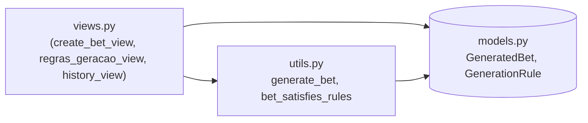
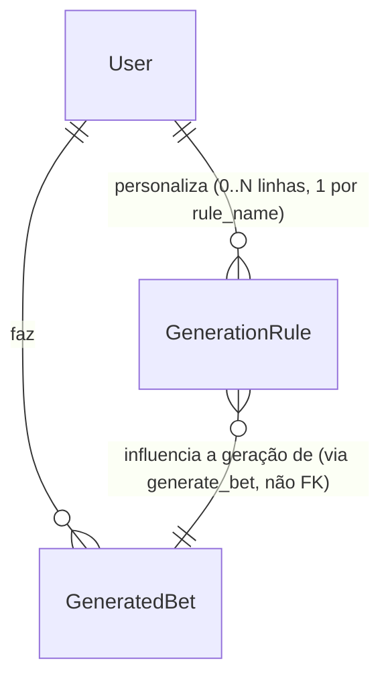

# Architecture Spine — Loterias: Home Reorganizada, Regras de Geração Personalizadas, Histórico com Filtros (adendo 2026-09-17)

## Design Paradigm

Sem mudança de paradigma — continua **Django MVT monolith**, sem uma segunda forma de execução nova (nenhuma peça deste adendo roda em `jobs.py`/cron; tudo é request/response). A única camada nova de fato é a leitura de `GenerationRule` dentro do fluxo síncrono de geração de aposta, que já hoje só roda em `views.py` chamando `utils.py` (nunca em `jobs.py` — ver AD-7 herdado).

## Inherited Invariants

| Inherited | From parent | Binds here |
| --- | --- | --- |
| Paradigma (Shared-Database batch) | architecture-Loterias-2026-09-08 | `GenerationRule` nunca é lido/escrito por `jobs.py` — só pelo processo web (views/utils), evitando que este adendo reintroduza o canal de comunicação entre processos que o spine pai proíbe. |
| AD-1 (identificadores em inglês) | architecture-Loterias-2026-09-08 | `GenerationRule`, `bet_satisfies_rules`, todo campo/função novos deste adendo. |
| AD-3 (novos models de domínio ficam em `apps/loterias_core`, sem app novo) | architecture-Loterias-2026-09-08 | `GenerationRule` declarado em `apps/loterias_core/models.py`, junto de `GeneratedBet`/`NotificationPreference`/`PrizeTier`. |
| AD-4 (cobertura por estado, `get_or_create`, cache em `GeneratedBet`) | architecture-Loterias-2026-09-08 | Filtro "só premiados" (FR-24) lê o campo-cache `GeneratedBet.prize` diretamente (AD-14) — nunca reconsulta `HitNotification`. |
| AD-7 (SQLite com `timeout=20`, dois processos escrevendo) | architecture-Loterias-2026-09-08 | `GenerationRule` é escrito só pela view de edição (FR-18), nunca por `jobs.py` — sem contenção nova entre `loterias-web`/`loterias-cron`. |
| Convenção (nenhum model de "estado pendente" novo quando ausência já basta, ex. AD-9) | architecture-Loterias-2026-09-08 | Ausência de linhas `GenerationRule` para um (user, game) É o estado "default" (AD-13) — nenhum campo/flag `is_customized` redundante. |

## Invariants & Rules



### AD-11 — `GenerationRule`: uma tabela relacional, uma linha por (user, game, rule_name)

- **Binds:** FR-18, FR-19, FR-20, FR-21, FR-23.
- **Prevents:** três models quase-idênticos por família de jogo (a mesma duplicação que a retrospectiva do Epic 2 já flagou como padrão recorrente a evitar — ver `_bmad-output/implementation-artifacts/epic-2-retro-2026-09-16.md`); dois builders decidindo de forma incompatível onde mora "qual regra foi alterada por último" (campo extra vs. convenção implícita); gravar `numeric_value` e `choice_value` juntos na mesma linha sem nada barrar isso; e dois builders hardcodando conjuntos diferentes de `rule_name` válidos por Jogo em dois pontos do código (achado F6/F7 da revisão adversarial, `reviews/review-adversarial.md`).
- **Rule:** `GenerationRule(user, game, rule_name, enabled, numeric_value, choice_value, updated_at)`, com `unique_together = ('user', 'game', 'rule_name')`. `numeric_value` (`IntegerField`, nullable) cobre toda regra liga/desliga+valor (FR-19 a FR-21); `choice_value` (`CharField`, nullable) cobre só `tipo_distribuicao` (`'homogenea'`/`'totalmente_aleatoria'`, FR-19/FR-20). Um `CheckConstraint` no model garante que os dois **nunca** venham preenchidos juntos (`~Q(numeric_value__isnull=False, choice_value__isnull=False)`) — nunca só prosa. (Não é XOR estrito: uma linha desligada, sem valor salvo, tem os dois nulos — atualizado na Story 4.3.) O conjunto de `rule_name` válido por Jogo vive em **um único dict Python**, `RULE_NAMES_BY_GAME` em `models.py`, ao lado de `GAMES_CONFIG` — `rule_name` usa `choices=` derivado desse dict, e toda view/form que valida `GenerationRule` importa dele; a tabela da Capability → Architecture Map é documentação derivada desse dict, nunca a fonte. "Mais recentemente alterada" (FR-22) é sempre `updated_at` da linha específica, nunca um campo separado de auditoria — mas só entre as linhas efetivamente violadas numa tentativa de geração (ver AD-12).

  *(Por que não `JSONField`: o projeto já usa `JSONField` em 7 campos hoje — `GeneratedBet.numbers/clovers`, `LotteryResult.numbers/clovers/prizes/numbers_second_draw/prizes_second_draw`, `GameStatistics.most_frequent_numbers` — então "sem precedente" nunca foi o motivo real. O motivo é que `GenerationRule` precisa de `updated_at` **por regra individual** para o relax do FR-22, e cada `JSONField` existente no projeto guarda uma lista/dict solto, nunca uma configuração nomeada com necessidade de timestamp próprio por chave.)*

### AD-12 — `generate_bet()` ganha uma função-irmã pura de checagem; retry relaxa no máximo 1 regra por chamada

- **Binds:** FR-18, FR-22, FR-23, `apps/loterias_core/utils.py`.
- **Prevents:** lógica de checagem de regra misturada dentro do corpo de `generate_bet()` (difícil de testar isolada da geração de candidatos); uma camada de classes/"motor de regras" por família de jogo (primeira abstração orientada a objetos do projeto — over-engineering pra ~15 regras distintas no total, incoerente com o resto de `utils.py`, que é só funções); duas implementações incompatíveis de "qual regra relaxar" quando o limite de tentativas estoura; e — achados críticos F1/F3 da revisão adversarial (`reviews/review-adversarial.md`) — uma assinatura de função que não consegue de fato reportar "quais regras" um candidato violou, e duas queries com propósitos opostos (uma pra decidir o modo default/personalizado, outra pra alimentar a checagem) sendo confundidas numa só.
- **Rule:** nova função pura `bet_satisfies_rules(numbers: list[int], clovers: list[int], game: str, rules: list[GenerationRule]) -> tuple[bool, list[str]]` em `utils.py` — retorna a **lista completa** de `rule_name` que o candidato violou (lista vazia = satisfaz tudo), nunca só a primeira; sem side-effect, sem I/O, testável isolada.

  `generate_bet(game, user)` monta duas queries distintas e nomeadas, propositalmente diferentes:
  - `has_customization = GenerationRule.objects.filter(user=user, game=game).exists()` — **sem** filtro de `enabled` — decide só o modo (AD-13): `False` → comportamento de hoje (`GAMES_WITH_SEQUENCE_RULE`/`count_sequential_pairs`); `True` → segue abaixo.
  - `active_rules = GenerationRule.objects.filter(user=user, game=game, enabled=True)` — **com** filtro de `enabled` — é a lista passada a `bet_satisfies_rules` a cada candidato. Uma regra com `enabled=False` nunca constrange a geração, mesmo que sua linha exista (ela só conta pro `has_customization` acima).

  O loop de tentativas usa `max_attempts=10000` — o mesmo já existente hoje no próprio `generate_bet()` (não os 1000 de `regenerate_bet_view`, que é só uma referência de padrão de retry, não o valor a copiar). Esgotadas as 10000 tentativas com `active_rules` completo: entre as `rule_name` que o **último** candidato violou (a lista que `bet_satisfies_rules` retornou nessa última tentativa), escolhe a de maior `updated_at` (nunca a mais recente no geral entre todas as regras do usuário — relaxar uma regra que não causou o conflito não ajudaria), remove só essa do `active_rules` em memória (nunca grava no banco) e roda mais até 10000 tentativas com o conjunto reduzido. No máximo 1 regra é relaxada por chamada (FR-22 fala em "a regra", singular). Se ainda assim falhar, cai na mensagem já existente "Não foi possível gerar um jogo único" — nunca tenta relaxar uma segunda regra.

### AD-13 — Ausência de `GenerationRule` é o estado "default"; a Regra de Sequência adaptativa nunca coexiste com uma regra personalizada

- **Binds:** FR-23, `GAMES_WITH_SEQUENCE_RULE`, `MIN_SEQUENCE_INTERVAL`, `count_sequential_pairs`, `views.regras_geracao_view`.
- **Prevents:** um campo `is_customized`/model de estado redundante (a mesma lição já aplicada em AD-9 do spine pai — `set_unusable_password()` em vez de campo novo); os dois mecanismos de controle de sequência (o adaptativo herdado e o toggle estático de FR-19) rodando ao mesmo tempo pro mesmo Jogo+usuário; e — achado crítico F2 da revisão adversarial (`reviews/review-adversarial.md`) — um builder implementando "desmarcar uma regra" como `DELETE` da linha (padrão CRUD mais natural em Django), o que reabriria silenciosamente a porta pro par (user, game) voltar ao comportamento adaptativo legado assim que a última linha "desligada" fosse removida, mesmo que o usuário achasse que só tinha desligado uma regra, não resetado tudo.
- **Rule:** `GenerationRule.objects.filter(user=, game=).exists() == False` (sem filtro de `enabled` — ver AD-12) é a única forma de "usando o default do sistema". `regras_geracao_view` (FR-18) **nunca deleta** uma linha de `GenerationRule` ao desmarcar um toggle no formulário — sempre `update_or_create` gravando `enabled=False` na linha existente (ou criando-a já com `enabled=False`, se nunca existiu). Salvar o formulário grava uma linha por `rule_name` mostrado na tela daquele Jogo (todas, ligadas ou desligadas) — é assim que `exists()` reflete de verdade "usuário configurou esse Jogo". O **único** caminho que deleta linhas é o botão "Restaurar padrão" do UX (`GenerationRule.objects.filter(user=, game=).delete()`) — ação explícita e distinta de desmarcar um toggle individual. A partir do primeiro save de `regras_geracao_view` pra aquele (user, game), a Regra de Sequência adaptativa para de ser consultada pra esse par — só os toggles explícitos de FR-19/FR-20/FR-21 valem (incluindo o caso de todos desligados, que reduz a 0 regras ativas de fato, não ao comportamento adaptativo de volta) — até um eventual "Restaurar padrão".

### AD-14 — Filtros de histórico (FR-24) são `QuerySet.filter()` direto em `GeneratedBet`, sem join novo

- **Binds:** FR-24, `history_view`.
- **Prevents:** um filtro "premiado" reconsultando `HitNotification` (join extra, quando `GeneratedBet.prize` já é a fonte cache existente por AD-4 herdado) ou uma tabela/index nova só pra filtro.
- **Rule:** Jogo → `filter(game=<valor>)`. Premiado → `filter(prize__gt=0)`. Período → `filter(created_at__range=(inicio, fim))` — data de **geração** do `GeneratedBet` (`created_at`), nunca a data de captura do resultado (`LotteryResult.captured_at` é um dado técnico diferente, não o "período" que o usuário quer dizer). Os 3 filtros combinam por `AND` (cumulativos, nunca `OR`) — cada filtro presente na querystring encadeia mais um `.filter()` na mesma queryset. Os inputs de período são `<input type="date">` (sem hora, ver EXPERIENCE.md) — `inicio`/`fim` do `range` são limites **inclusivos**, convertidos pro início (`00:00:00`) e fim (`23:59:59`) do dia informado, no `TIME_ZONE` do projeto (`settings.py`) — nunca uma data naive comparada direto contra o `DateTimeField` timezone-aware de `created_at` (achado baixo F8 da revisão adversarial, `reviews/review-adversarial.md`).

## Consistency Conventions

| Concern | Convention |
| --- | --- |
| Naming (entities, files, interfaces, events) | Inglês em todo identificador novo (AD-1 herdado). `rule_name` usa snake_case em inglês nos valores de choices (ex. `limit_sequence_count`, `distribution_type`) mesmo a UI mostrando o rótulo em português — mesmo padrão de `verbose_name` já usado no projeto. |
| Data & formats | `GenerationRule.numeric_value`: `IntegerField(null=True)`. `updated_at`: `DateTimeField(auto_now=True)` (mesmo padrão de `GeneratedBet.updated_at`). Slug de URL do Jogo em `/regras/<jogo>/`: `GAMES_CONFIG` já usa nomes ASCII-safe sem espaço (`Mega-sena`, `Milionaria`, `Lotomania`, `Lotofacil`, `Quina`, `Dupla-Sena`) — o slug é o nome em lowercase, sem tabela de mapeamento nova. |
| State & cross-cutting | Views novas (`regras_geracao_view`, filtros de `history_view`) entram em `apps/loterias_core/views.py` — convenção real do código hoje (nenhum pacote `views/`), não uma decisão nova deste spine. `GenerationRule` só é escrito pela própria tela de edição (FR-18) — nenhum outro caminho de escrita, mesmo padrão de exclusividade de escrita já usado por `NotificationPreference` (spine pai). |

## Stack

Sem mudança — mesmo stack do spine pai (Python 3.11, Django 5.0.6, SQLite bundled). Nenhuma dependência nova: `bet_satisfies_rules`/`GenerationRule` usam só Django ORM + Python padrão. Nenhuma migration além de `CREATE TABLE` pra `GenerationRule` (model novo, sem alteração em tabela existente).

**NFR de latência (PRD FR-22 §4.4):** o pior caso de AD-12 dobra o teto de tentativas hoje existente (até 10000 + 10000 = 20000, contra os 10000 de hoje) — mas cada tentativa é trabalho em memória (amostragem aleatória + aritmética), sem I/O/query por tentativa, então o teto dobrado não introduz espera perceptível nova; a NFR do PRD é satisfeita pela natureza do laço, não por um ajuste adicional.

## Structural Seed

```text
apps/
  loterias_core/
    models.py           # + RULE_NAMES_BY_GAME (dict, ao lado de GAMES_CONFIG — fonte unica do enum de rule_name por Jogo, AD-11)
                         # + GenerationRule (user, game, rule_name, enabled, numeric_value,
                         #   choice_value, updated_at — unique_together user+game+rule_name,
                         #   CheckConstraint "nunca ambos" numeric_value/choice_value — AD-11)
    utils.py             # + bet_satisfies_rules(numbers, clovers, game, rules) -> (ok, violated_rule_names: list[str]) (AD-12)
                         # generate_bet() estendido: has_customization/active_rules, loop max_attempts=10000 com relax (AD-12/AD-13)
    views.py             # + regras_geracao_view (FR-18, GET pré-carrega/POST salva)
                         # history_view estendida: filtros game/período/premiado via querystring (AD-14)
    urls.py               # + path('regras/<slug:jogo>/', views.regras_geracao_view, name='generation_rules')
    migrations/           # + migration criando GenerationRule
templates/loterias_core/
    home.html             # reorganizado (FR-16/FR-17) — ver DESIGN.md/EXPERIENCE.md do UX, sem invariante de arquitetura nova
    regras_geracao.html   # NOVO — formulário por família de jogo (FR-19/FR-20/FR-21)
    historico.html         # + barra de filtros (FR-24) — ver EXPERIENCE.md `filter-bar`
```



## Capability → Architecture Map

| Capability / Área | Vive em | Governado por |
| --- | --- | --- |
| FR-16, FR-17 (reorganização da home, ícone por Jogo) | `templates/loterias_core/home.html` | UX (DESIGN.md/EXPERIENCE.md) — sem AD de arquitetura, é só template/CSS, nenhum model/view novo |
| FR-18 (edição de Regra de Geração) | `views.regras_geracao_view`, `templates/loterias_core/regras_geracao.html` | AD-11, AD-13 |
| FR-19 — Mega-Sena | `rule_name` ∈ {`limit_sequence_count`, `limit_sequence_pairs`, `limit_row_count`, `limit_column_count`, `distribution_type`} — lista fechada, grid confirmado (PRD §8.5) | AD-11, `RULE_NAMES_BY_GAME` |
| FR-19 — +Milionária, Quina, Dupla-Sena | `rule_name` ∈ {`limit_sequence_count`, `limit_sequence_pairs`, `distribution_type`} — **sem** `limit_row_count`/`limit_column_count` até o grid do volante desses 3 ser confirmado (ver Deferred); habilitar as 2 choices quando resolvido | AD-11, `RULE_NAMES_BY_GAME` |
| FR-20 — Lotofácil | `rule_name` ∈ {`limit_sequence_count`, `limit_sequence_pairs`, `limit_min_gap_between_sequences`, `limit_min_sequences`, `limit_row_count`, `limit_column_count`, `distribution_type`} — lista fechada, 7 regras (PRD FR-20 lista `distribution_type` explicitamente — não é herança implícita de FR-19), grid confirmado (PRD §8.5) | AD-11, `RULE_NAMES_BY_GAME` |
| FR-21 — Lotomania | `rule_name` ∈ {`limit_sequence_count`, `limit_min_gap_between_sequences`, `limit_min_sequences`} — lista fechada, sem linha/coluna/distribuição | AD-11, `RULE_NAMES_BY_GAME` |
| FR-22 (resolução de conflito) | `utils.generate_bet` (loop de retry) | AD-12 |
| FR-23 (default vs. personalizada) | `utils.generate_bet` (fallback quando `GenerationRule` vazio) | AD-13 |
| FR-24 (filtros de histórico) | `views.history_view` | AD-14 |

## Deferred

- PRD §8.5 — grid do volante oficial (linha/coluna) pra Quina, +Milionária e Dupla-Sena: pesquisa web feita nesta sessão confirmou só Mega-Sena (6×10) e Lotofácil (5×5) com fonte; os outros 3 não têm contagem de colunas confirmada online — verificar direto com a Caixa ou um volante físico antes de implementar FR-19 pra esses 3 especificamente. Mega-Sena e Lotofácil podem prosseguir.
- PRD §8.6 — faixa de valores válida por regra/Jogo (ex. limite de sequência entre 1 e quanto pra cada Jogo) — tuning de produto específico por regra, não invariante de arquitetura; `numeric_value` é um `IntegerField` genérico, a validação de faixa fica em `forms.py`, decisão do Boss por story.
- Divisão de `views.py` em um pacote (`views/`) — item de ação já registrado na retrospectiva do Epic 2 (`epic-2-retro-2026-09-16.md`); este adendo adiciona ~1 view nova e estende 1 existente, ainda abaixo do limiar que justificaria a divisão agora.
- Modo WAL do SQLite — débito técnico já conhecido e deferido 3× no Epic 2 (mesma causa raiz); este adendo não piora a situação (nenhuma escrita nova de `jobs.py`), não revisitado aqui.
